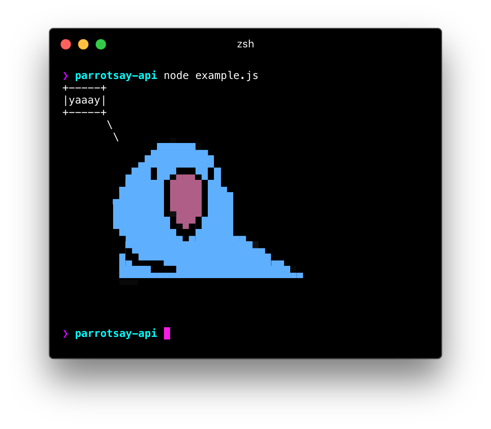

# parrotsay-api

## Install

```
npm install --save parrotsay-api
```

## Usage

```js
// example.js
const parrotSay = require('parrotsay-api')

parrotSay('yaaay')
  .then(console.log)
  .catch(console.error)
```

<!-- TODO: change it to a GitHub url – see https://git.io/hpm README.md -->

## Related

- [Cult of the Party Parrot](http://cultofthepartyparrot.com/)

## License

MIT © [Matheus Fernandes](http://matheus.top)
